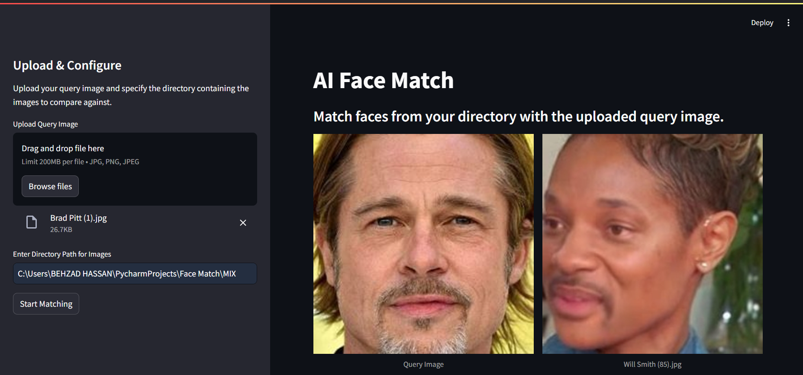
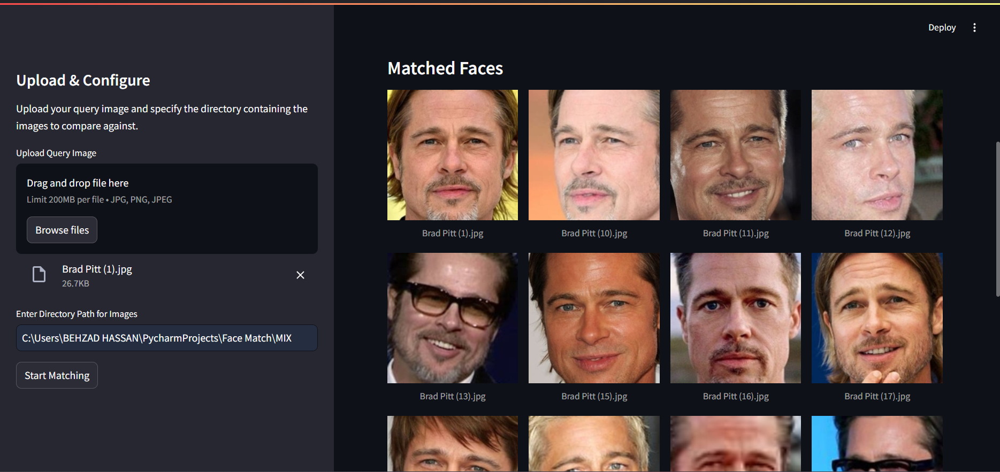

# Face Match with Streamlit GUI

Face Match is a Python-based application that uses FaceNet for accurately matching faces from a given query image against all images in a specified directory. Built with **Streamlit** for a user-friendly graphical interface, this project allows users to easily upload a query image, scan a directory of images, and view matching results directly in the GUI.

## Table of Contents

- [Overview](#overview)
- [Installation](#installation)
- [Running the Application](#running-the-application)
- [Usage Guide](#Using-the-Application)
- [Files and Structure](#files-and-structure)
- [Demo](#demo-gif)
- [Contact](#contact)

---

## Overview

This project is designed to make face match accessible and straightforward by providing a simple GUI using **Streamlit**. Here’s how it works:

- The user uploads a **query image**.
- The application iterates over all images in a specified directory, comparing each face to the query image using **FaceNet** to detect matches.
- If matches are found, they are displayed in a grid layout within the GUI. Otherwise, a "No Match" message is shown.

### Key Features

- **Accurate Face Matching**: Powered by FaceNet for reliable facial match.
- **Interactive Streamlit GUI**: Easily upload and view results without command-line operations.
- **Modular Code Structure**: Two main files handle the GUI (`Main.py`) and the face-matching logic (`FaceNetMatch.py`).
- **Extendable**: Built to be adaptable for further enhancement and feature additions.

## Installation

To get started with the Face Match project, you’ll need to clone the repository and install the required dependencies. 

### Prerequisites

Ensure you have the following installed:
- **Python 3.8 or later**
- **pip** (Python package installer)

### Steps

1. **Clone the Repository**

    ```bash
    git clone https://github.com/BehzadHassan/face-match.git
    cd face-match
    ```

2. **Install Dependencies**

    Install the necessary packages using the provided `requirements.txt` file:

    ```bash
    pip install -r requirements.txt
    ```

    The `requirements.txt` file includes key dependencies like:
    - **facenet_pytorch**: For FaceNet-based face encoding and comparison.
    - **Streamlit**: For building and running the GUI.
    - **opencv-python**: For image processing.
    - **numpy**: For numerical computations.

## Running the Application

Once the installation is complete, you can start the face match application using the Streamlit GUI. Follow these steps to launch the application:

### Steps to Launch

1. **Run the Main Application**

    In the terminal, navigate to the project directory (if you aren’t already there), and run:

    ```bash
    streamlit run Main.py
    ```

    This command will start the Streamlit server, and you should see an output similar to:

    ```
    You can now view your Streamlit app in your browser.
    Network URL: http://localhost:8501
    ```

2. **Open the Application in a Web Browser**

    Open the link provided (usually `http://localhost:8501`) in your web browser. This will open the application’s GUI, where you can interact with the face recognition tool.

## Using the Application

- **Upload a Query Image**: Use the file uploader in the GUI to upload the image you want to match against the images in the directory.
- **Select the Directory for Matching**: Specify the path to the directory containing the images you want to check for matches.
- **View Results**: The app will compare the query image with each image in the directory, and any matches found will be displayed in a grid. If no matches are found, a "No Match" message will appear.

## Files and Structure

The project is organized into two main Python files and a requirements file. Here’s a quick overview of each:
After cloning the repository, the directory structure should look like this:

```plaintext
face-match/
├── Main.py
├── facialFaceNetMatch.py
├── requirements.txt
└── README.md
```

### Main Files

1. **Main.py**
    - This file serves as the entry point for the application.
    - It sets up and runs the Streamlit GUI, allowing users to upload a query image and specify a directory for image matching.
    - `Main.py` calls functions from `FaceNetMatch.py` to perform face matching and displays the results in a grid format within the Streamlit interface.

2. **FaceNetMatch.py**
    - This file contains the logic for face matching.
    - It uses FaceNet’s encoding to compare the query image with each image in the specified directory and returns any matches found.
    - The matching function is optimized to iterate over all images in the directory, ensuring every face is checked against the query image.

### Additional Files

- **requirements.txt**: Lists all required packages and dependencies for the project, including `facenet_pytorch`, `streamlit`, `opencv-python`, and `numpy`. Install these dependencies using `pip install -r requirements.txt` to ensure smooth functionality.

## Demo

Here is a short demonstration of how the Face Match app works. It shows the process of uploading a query image, selecting a directory for image matching, and displaying the matched results in the Streamlit interface.


Select the query image and enter path to the directory, the process of matching will be started.

Once matching process is completed, the results will be shown at the bottom of the page.


## Contact

Thank you for your interest in the Facial Match project. I welcome any feedback, questions, or suggestions for further development. If you'd like assistance with implementing or extending this project, please don’t hesitate to reach out.

- **Email**: [behzadhassan967@gmail.com](mailto:behzadhassan967@gmail.com)
- **GitHub**: [BehzadHassan](https://github.com/BehzadHassan)

Your contributions, whether through code, ideas, or collaboration, are highly valued. Together, we can enhance and innovate on this project, making it even more robust and versatile.
